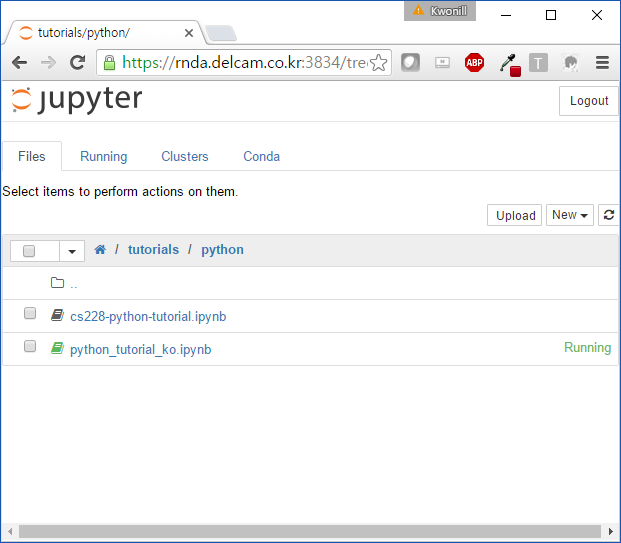
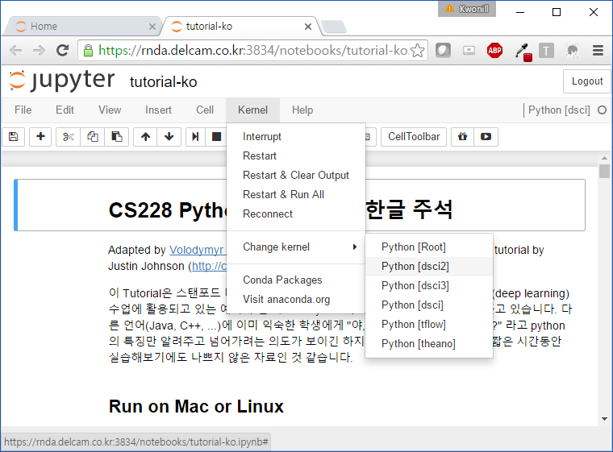
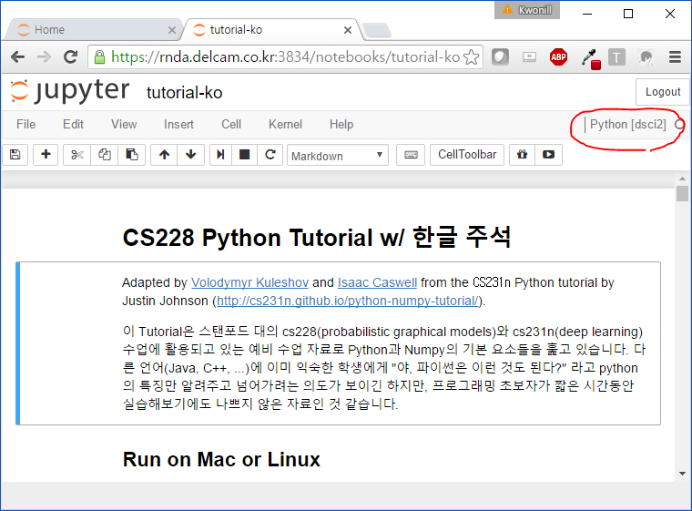

# Tutorials for Stanford cs228 and cs231n

Preparatory material for the probabilistic graphical models and the deep learning classes at Stanford.

## Material

This repo currently holds:

* A [tutorial](https://github.com/kuleshov/cs228-material/blob/master/tutorials/python/cs228-python-tutorial.ipynb) on basic Python/Numpy that is necesseary to get started with the above machine learning classes.

You may follow the iPython notebook on github, or clone and execute it locally.
The notebook is based on an [earlier version](http://cs231n.github.io/python-numpy-tutorial/) prepared by Justin Johnson.


## Run on Mac or Linux

- [Anaconda](https://www.continuum.io/downloads) 설치
-  가상환경 생성
```
$ conda create -n dsci2 python=2 pandas matplotlib jupyter
```
- 실습 파일 clone
```
$ mkdir -p ~/Project
$ cd ~/Project
$ git clone https://github.com/macromancer/cs228-material.git
```
- notebook 실행
```
$ cd ~/Project/cs228-material
$ juputer-notebook
```
  - jupyter notebook을 특정 port로 띄울 때는 --port=포트번호, 자동으로 브라우저를 띄우고 싶지 않을 때는 --no-browser 옵션을 사용하자.
```
$ juputer-notebook --port=3833 --no-browser
```
- tutorial 실행
  - chrome 이나 firefox로 접속하고, tutorial-ko.ipynb 클릭
  


  - 상단 메뉴에서 `Kernel >> Change Kernel >> Python(dsci2)`를 선택해 **2. 가상환경 생성**에서 준비한 dsci2 환경에서 본 실습을 진행할 수 있도록 합니다.
  
  
  
  - 아래 그림에서와 같이 `Python [dsci2]` 가 선택되어 있으면 준비완료!
  
